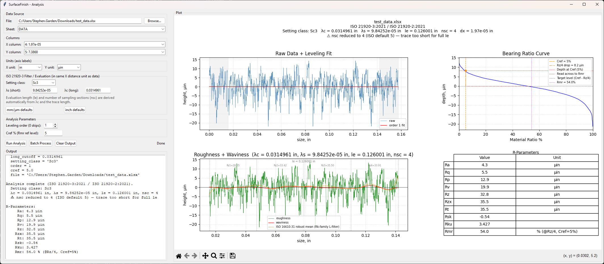

# SurfaceFinish



Surface roughness analysis toolkit with both CLI and Tkinter GUI front ends.

The current implementation targets:

- ISO 21920-3:2021 (profile acquisition / setting-class defaults)
- ISO 21920-2:2021 (parameter definitions)
- ISO 16610-21 (Gaussian S/L filtering)
- ISO 16610-31 (robust Gaussian regression L-filter for Rk-family source profile)

## Features

- TXT, CSV, and Excel input
- ISO setting classes Sc1-Sc5 via `iso21920.py`
- Automatic derivation of sampling section behavior:
	- `lsc = λc`
	- target `nsc = 5`
	- target `le = 5·λc`
- Automatic fallback when trace length is insufficient:
	- reduces `nsc` to the maximum that fits after filter edge buffers
	- emits warning text (`nsc_warning`) and flags this in plot banners/output
	- raises an error only when even one sampling section cannot fit
- Overview figure with:
	- raw + leveling fit
	- roughness + waviness (+ robust mean overlay)
	- bearing ratio curve with Rmr construction guides (`Cref`, `Rz/4` drop, target level, `Rmr`)
	- R-parameter table (`Ra`, `Rq`, `Rp`, `Rv`, `Rz`, `Rt`, `Rsk`, `Rku`, `Rmr`)
- Multi-standard comparison mode (GUI checkbox):
	- side-by-side table columns for ISO 21920, ISO 4287, and ASME B46.1
	- comparison uses each standard's intended roughness pipeline
	- ISO 4287 and ASME B46.1 are often numerically identical in this tool (Gaussian-based path), which is useful for customer-facing comparisons

## Standards Comparison (GUI)

In the GUI, enable **Compare Standards** before clicking **Run Analysis** to render a side-by-side parameter table.

- ISO 21920 column: S-filter (`λs`) then L-filter (`λc`)
- ISO 4287 column: L-filter (`λc`) on primary profile (no S-filter)
- ASME B46.1 column: Gaussian path aligned to the ISO 4287 comparison path

Displayed parameters in comparison mode:

- `Ra`, `Rq`, `Rp`, `Rv`, `Rz`, `Rt`, `Rsk`, `Rku`, `Rmr`

Notes:

- `Rmr` is computed per column using the selected `Cref`.
- `Rt` is kept as the total-height metric in the table; `Rzx` is not shown.

## Quick Start

### GUI

```bash
python gui.py
```

GUI tip for inch data: use the **inch defaults** button (or Sc-class defaults with unit conversion) so `λs`/`λc` are in the same X-distance unit as your input trace.

### CLI

```bash
python main.py
```

If no `--file` is provided, CLI mode auto-prompts to choose an `.xlsx` in the project root.

## CLI Usage

Example using explicit file/sheet/columns/units:

```bash
python main.py --file "data/48743-004 trell sample t1.xlsx" --sheet "DATA" --x-col 4 --y-col 5 --x-unit in --y-unit "µin"
```

You can also pass column names instead of indexes:

```bash
python main.py --file "measurements.xlsx" --sheet "TraceData" --x-col "Distance" --y-col "Height" --x-unit mm --y-unit "µm"
```

### Important arguments

- `--setting-class {Sc1..Sc5,Custom}` (default `Sc3`)
- `--short-cutoff` and `--long-cutoff` (override setting-class defaults)
- `--order` (leveling order: 0, 1, 2, 3)
- `--plot-level` (show leveling preview)
- `--no-plot-roughness`
- `--no-plot-mr`

Note: evaluation length (`le`) and sampling section count (`nsc`) are backend-derived from `λc` and trace length. They are not user-configurable CLI options.

## Input Notes

- `--sheet` accepts a sheet name (for example `DATA`) or zero-based sheet index (`0`).
- `--x-col` and `--y-col` accept zero-based indexes or exact column names.
- `.txt`/`.csv` inputs use the first two columns unless pre-processed otherwise.

## Environment Setup

Use one of the following approaches.

### Option 1: venv + pip

```bash
python -m venv .venv
.venv\\Scripts\\activate
python -m pip install -r requirements.txt
```

### Option 2: conda

```bash
conda env create -f SurfFin.yml
conda activate SurfFin
```

`SurfFin.yml` is a Conda environment file and is not used with `pip install -r`.
