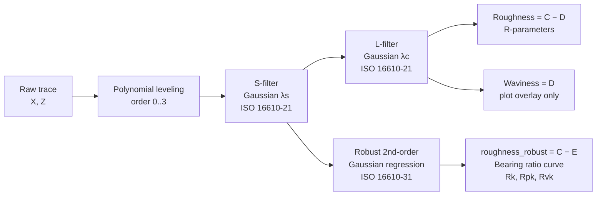

# Surface-Finish Standards — Parameter Reference

A side-by-side reference for every R-parameter computed by this toolkit,
covering how the relevant standards define it and exactly how the code
implements it. Use the per-parameter chapters as the canonical answer to
"why does our number differ from the customer's?" or "what is Rsk again?".

> **TL;DR.** Surface texture parameters look the same across standards on the
> page, but the *filter chain* and the *aggregation rule* (per sampling
> length vs. one-shot over the evaluation length) differ between
> ISO 21920-2:2021, ISO 4287:1997 and ASME B46.1. This tool implements all
> three on demand. The numbers diverge most visibly on **Rsk** and **Rku**;
> **Ra, Rp, Rv, Rz, Rt, Rmr** are numerically identical between the columns
> in this implementation; **Rq** drifts marginally because ISO 4287 averages
> per-sampling-length RMSes rather than a single RMS over the evaluation
> length. The Rk-family (Rk, Rpk, Rvk) is sourced from the ISO 16610-31
> robust regression filter and is ISO 21920-2 only.

---

## How to use this document

- **Customer call mode** — skim the **Quick comparison matrix** (next section)
  and the **"Differences between standards"** callout at the end of each
  parameter chapter. The **Cheat sheet** at the back distils the most common
  customer questions to one-line answers.
- **Refresher mode** — read top to bottom. Each parameter is laid out:
  plain-language definition → formula → ISO clause citation → how the tool
  computes it (linked to the source) → standards-differences callout.
- **Verbatim ISO text** — short quotes here paraphrase well-known canonical
  language. Where a verbatim clause from a controlled PDF would strengthen
  the doc, look for `<!-- VERBATIM_FROM_PDF: ... -->` markers and paste from
  your local copies (the standards are gitignored).
- **Source links** — every code reference points at the file and line range
  in this workspace.

---

## Standards covered

This document only describes standards that this tool actually implements
or reports against.

| Standard | Role in this toolkit |
| --- | --- |
| **ISO 21920-2:2021** | Parameter definitions for profile (R-) texture |
| **ISO 21920-3:2021** | Specification operator: setting classes Sc1–Sc5, sampling length, evaluation length, sectioning |
| **ISO 4287:1997** | Legacy parameter definitions and per-sampling-length aggregation rule (still requested by many customers) |
| **ASME B46.1** | US harmonised practice; Gaussian-filter path numerically aligned with ISO 4287 in this tool |
| **ISO 16610-21** | Gaussian phase-correct profile filter (S- and L-filters) |
| **ISO 16610-31:2010** | Robust 2nd-order Gaussian regression filter — used as the L-operator for the Rk-family |

> The older ISO 4288, ISO 3274, ISO 11562 and ISO 13565-2 are intentionally
> out of scope here — they are referenced informally in the wider literature
> but every numeric routine in this codebase aligns to the standards listed
> above.

---

## Quick comparison matrix

How each parameter is treated in the three columns the GUI's **Compare
Standards** toggle renders:

| Parameter | ISO 21920-2:2021 | ISO 4287:1997 | ASME B46.1 |
| :-- | :-- | :-- | :-- |
| **Ra** | Single mean of \|z\| over `le` | Mean of per-`lsc` Ra values | Same as ISO 4287 (Gaussian path) |
| **Rq** | Single RMS over `le` | Mean of per-`lsc` Rq values *(diverges slightly)* | Same as ISO 4287 |
| **Rp** | Mean of per-section peaks | Mean of per-`lsc` peaks | Same as ISO 4287 |
| **Rv** | Mean of per-section valleys | Mean of per-`lsc` valleys | Same as ISO 4287 |
| **Rz** | Rp + Rv (mean of section peak-to-valley) | Mean of per-`lsc` Rz | Same as ISO 4287 |
| **Rt** | `max − min` over the full `le` | `max − min` over the full `le` | Same as ISO 4287 |
| **Rsk** | Single 3rd moment ÷ Rq³ over `le` | Mean of per-`lsc` Rsk values *(diverges)* | Same as ISO 4287 |
| **Rku** | Single 4th moment ÷ Rq⁴ over `le` | Mean of per-`lsc` Rku values *(diverges)* | Same as ISO 4287 |
| **Rmr (c, d) @ Rz/4** | Cref / Rz-quarter heuristic | Same heuristic (kept for column parity) | Same heuristic |
| **Rk, Rpk, Rvk** | bf40 line on the bearing curve of `roughness_robust` (ISO 16610-31 source) | Not reported under ISO 4287 | Not reported under B46.1 |

> **Reading the matrix.** "Same as ISO 4287" means *byte-for-byte* identical
> in this implementation — the B46.1 column intentionally re-uses the
> ISO 4287 routine when the harmonised Gaussian filter is in use. Where a
> cell says *(diverges)*, expect the customer to see a different number; the
> chapter for that parameter explains why.

---

## Setting classes (ISO 21920-3:2021, Table 1)

Every analysis run is anchored to a *setting class* — a coupled tuple of
filter cutoffs, evaluation length, sectioning and tip radius. The values in
this table are the canonical Table 1 values pulled verbatim from
[iso21920.py](iso21920.py#L80-L86).

| Class | λs (mm) | λc / lsc (mm) | dx_max (mm) | le (mm) | nsc | rtip (μm) |
| :--: | --: | --: | --: | --: | --: | --: |
| Sc1 | 0.0025 | 0.08 | 0.0005 | 0.40 | 5 | 2.0 |
| Sc2 | 0.0025 | 0.25 | 0.0005 | 1.25 | 5 | 2.0 |
| Sc3 | 0.0025 | 0.80 | 0.0005 | 4.00 | 5 | 2.0 |
| Sc4 | 0.0080 | 2.50 | 0.0015 | 12.5 | 5 | 5.0 |
| Sc5 | 0.0250 | 8.00 | 0.0050 | 40.0 | 5 | 10.0 |

<!-- VERBATIM_FROM_PDF: ISO 21920-3:2021 §4.2 / Table 1 — paste the canonical row definitions here -->

**Default class** in this toolkit is **Sc3** (suitable for most ground and
finished surfaces). Override at the CLI (`--setting-class Sc2`) or in the
GUI's **Sc** dropdown.

**Tolerance-driven recommendation.** When given a parameter and a tolerance
in μm, `recommend_setting_class()` in
[iso21920.py](iso21920.py#L216-L290) walks the ISO 21920-3 §4.4 / Tables 3–6
thresholds and returns the smallest class that envelops the tolerance.
Treat the thresholds in `_RECOMMENDATION_TABLES_UM`
([iso21920.py](iso21920.py#L186-L201)) as a first-pass engineering
interpretation — verify against the controlled PDF before using them for
certification work.

---

## The measurement chain

Every parameter starts from the same raw trace and walks the same pipeline.
The branches diverge only at the *final aggregation* step.



The four profiles the code carries simultaneously:

| Profile | Source | Used for |
| --- | --- | --- |
| `primary` | Raw trace, leveled | Loading, plotting, waviness derivation |
| `denoised_primary` | S-filter(`primary`) | Roughness base, robust-regression input |
| `waviness` | L-filter(`denoised_primary`) | Waviness overlay on plots |
| `roughness` | `denoised_primary − waviness` | Ra, Rq, Rp, Rv, Rz, Rt, Rsk, Rku, Rmr |
| `roughness_robust` | `denoised_primary − robust_mean` | Bearing-ratio curve, Rk-family |

See [SurfaceTexture.py L583–L611](SurfaceTexture.py#L583-L611) for the slice
points and [SurfaceTexture.py L639–L650](SurfaceTexture.py#L639-L650) for
the robust branch.

### Sampling length, evaluation length, sections

- **lsc** (sampling-section length) — equals λc.
- **nsc** — target number of sampling sections (5 by default per
  ISO 21920-3).
- **le** — evaluation length, `lsc × nsc`.
- **edge_buffer** — `⌈λs / 2T⌉ + ⌈λc / 2T⌉` samples at *each* end of the
  trace; these are excised from the usable region so the Gaussian filter's
  end-effect does not enter any reported parameter.

When the trace is too short to fit five `lsc` sections plus the edge
buffer, the tool reduces `nsc` toward 1 and records the deviation on
`self.nsc_warning`. If even one section will not fit, a
`TraceTooShortError` is raised that suggests the largest setting class that
*would* fit. See [SurfaceTexture.py L482–L578](SurfaceTexture.py#L482-L578).

### Gaussian filter (ISO 16610-21)

Standard deviation in sample-space is $\sigma = F_s / (2 \pi \cdot f_c)$
where $f_c = 1/\lambda$. The window is truncated where the Gaussian
underflows in float64 (~38σ). Implementation:

```python
def gauss_filter(data, cutoff):
    sigma = abs(self.Fs / (2 * np.pi * cutoff))
    sigma = max(sigma, np.finfo(float).eps)
    half = max(int(np.ceil(38.0 * sigma)), 1)
    window_len = 2 * half + 1
    window = signal.windows.gaussian(window_len, sigma) / (sigma * np.sqrt(2 * np.pi))
    window = window[window > 0]
    return signal.fftconvolve(data, window, mode="same")
```
[SurfaceTexture.py L462–L476](SurfaceTexture.py#L462-L476).

<!-- VERBATIM_FROM_PDF: ISO 16610-21 — paste the Gaussian-filter transmission characteristic / 50% transmission definition here -->

### Robust 2nd-order Gaussian regression (ISO 16610-31:2010)

The L-operator for the Rk family per ISO 21920-3 Table 1. Iteratively
reweighted local quadratic regression with Gaussian spatial weights of
$\sigma = \lambda_c / (2\pi)$ and Tukey biweight on residuals scaled by
$1.4826 \cdot \mathrm{MAD}$. The cut-off constant $c_b = 4.4478$ is taken
from the standard.

Each iteration solves the 3×3 weighted normal-equations system at every
sample via Cramer's rule. Convergence: 8 iterations max, tolerance
$5 \times 10^{-4}$ on the relative maximum change.

```python
ur = residuals / (cb * scale)
delta = np.where(np.abs(ur) < 1.0, (1.0 - ur ** 2) ** 2, 0.0)
# Weighted moments M0..M4 + targets T0..T2 computed via FFT convolutions,
# then det_A and det_a solve the 3x3 system at every sample via Cramer's rule.
```
[SurfaceTexture.py L914–L998](SurfaceTexture.py#L914-L998).

<!-- VERBATIM_FROM_PDF: ISO 16610-31:2010 §5 (filter equation) and §6 (cb constant table) — paste here for normative confirmation -->

If the robust filter fails for any reason the tool silently falls back to
the linear-filtered `roughness` for the bearing-ratio computation — this is
logged but not raised.

---

# Per-parameter chapters

Each chapter follows the same shape:

1. **Definition** in plain language.
2. **Formula** in standard notation.
3. **ISO clause** with a short canonical phrasing and a
   `VERBATIM_FROM_PDF` marker where you can paste exact wording from your
   gitignored copies.
4. **How this tool computes it** — code excerpt + line link.
5. **Differences between standards** — boxed callout. Explicit "identical"
   notes where the tool gives byte-for-byte the same answer across columns.

---

## Ra — arithmetical mean deviation

**Plain-language.** Average distance of the roughness profile from its
mean line, ignoring sign. The most widely-specified surface-finish number
in the world.

**Formula.**

$$
R_a = \frac{1}{n} \sum_{i=1}^{n} \lvert z_i \rvert
$$

over $n$ samples of the roughness profile within the evaluation length.

**ISO clause.** ISO 21920-2:2021 §4.2.1 (Ra is the arithmetical mean of the
absolute values of the ordinate within a sampling/evaluation length); the
identical definition appears as ISO 4287:1997 §4.2.1.

<!-- VERBATIM_FROM_PDF: ISO 21920-2:2021 §4.2.1 Ra definition -->

**How this tool computes it.**

```python
params['Ra'] = (float(np.mean(np.abs(roughness))), y_units)
```
[SurfaceTexture.py L683](SurfaceTexture.py#L683) (ISO 21920 path) and
[SurfaceTexture.py L805](SurfaceTexture.py#L805) (per-sampling-length path,
which here reduces to the same numeric value because $\frac{1}{N}\sum_i
\mathrm{mean}_i(|z|)$ equals $\mathrm{mean}(|z|)$ whenever all sampling
sections are equal in size — and they are by construction).

> **Differences between standards.** *Identical* numerically across
> ISO 21920-2, ISO 4287 and ASME B46.1 in this tool, **provided the same
> filter chain is used**. This tool runs the same S-filter + L-filter chain
> for all three columns, so Ra is the same value in every column. Customers
> on legacy gauges that omit the S-filter will read a marginally higher Ra
> (noise is not removed); flag the filter chain rather than the parameter
> definition when reconciling.

---

## Rq — root-mean-square deviation

**Plain-language.** RMS of the roughness profile. More sensitive to
outliers (deep scratches, isolated peaks) than Ra; preferred by statisticians
and by anyone fitting bearing or sealing models.

**Formula.**

$$
R_q = \sqrt{\frac{1}{n} \sum_{i=1}^{n} z_i^2}
$$

**ISO clause.** ISO 21920-2:2021 §4.2.2 (the root-mean-square ordinate
value); ISO 4287:1997 §4.2.2.

<!-- VERBATIM_FROM_PDF: ISO 21920-2:2021 §4.2.2 Rq definition -->

**How this tool computes it.**

```python
Rq = float(np.sqrt(np.mean(roughness ** 2)))
params['Rq'] = (Rq, y_units)
```
[SurfaceTexture.py L684–L685](SurfaceTexture.py#L684-L685) (ISO 21920);
per-section average in [SurfaceTexture.py L806–L807, L822](SurfaceTexture.py#L806-L822).

> **Differences between standards.** ISO 21920-2 takes a single RMS over
> the whole evaluation length; ISO 4287 (as implemented in
> `_compute_r_params_iso4287`) averages the per-sampling-length Rq values.
> Because $\mathrm{mean}\bigl(\sqrt{\mathrm{mean}(z_{\text{section}}^2)}\bigr)
> \neq \sqrt{\mathrm{mean}(z^2)}$ in general, the two columns diverge
> *slightly* whenever the per-section Rq varies. On the worked example
> below: Rq = 0.337134 μm (ISO 21920) vs 0.334400 μm (ISO 4287 / B46.1),
> ≈ 0.8% lower. Most customers ignore this; metrology purists will not.

---

## Rp — maximum profile peak height (per section, averaged)

**Plain-language.** How tall the tallest peak in a single sampling length
typically is, averaged across the sections.

**Formula.**

$$
R_p = \frac{1}{n_{sc}} \sum_{i=1}^{n_{sc}} \max\bigl(z_{\text{section } i}\bigr)
$$

Each section's contribution $Z_{p,i}$ is the largest ordinate of the
roughness profile within that sampling length (ISO 21920-2 §3.2.4).

**ISO clause.** ISO 21920-2:2021 §4.1.2 — Rp is the arithmetic mean of the
largest profile peak heights $Z_{p,i}$ over the sampling sections of the
evaluation length. ISO 4287:1997 §4.1.2 carries the identical definition.

<!-- VERBATIM_FROM_PDF: ISO 21920-2:2021 §4.1.2 Rp definition + §3.2.4 Zp definition -->

**How this tool computes it.**

```python
for i in range(nsc):
    seg = roughness[i * lsc_samples:(i + 1) * lsc_samples]
    section_Rp.append(float(np.max(seg)))
...
params['Rp'] = (float(np.mean(section_Rp)), y_units)
```
[SurfaceTexture.py L696–L704](SurfaceTexture.py#L696-L704).

> **Differences between standards.** *Identical* numerically across all
> three columns in this tool, because both code paths (ISO 21920 and
> ISO 4287) section the same filtered roughness into the same `nsc`
> windows. The classical ISO 4287 wording uses "sampling length", and
> ISO 21920-2 uses "sampling section" of length `lsc = λc` — the two are
> the same length in this implementation. Customers running per-cutoff
> reports on older systems may see Rp from a single representative cutoff
> rather than an average; clarify the aggregation if your value differs.

---

## Rv — maximum profile valley depth (per section, averaged)

**Plain-language.** How deep the deepest valley in a single sampling length
typically is, averaged across the sections. Reported as a *positive*
number.

**Formula.**

$$
R_v = \frac{1}{n_{sc}} \sum_{i=1}^{n_{sc}} \bigl\lvert \min\bigl(z_{\text{section } i}\bigr) \bigr\rvert
$$

**ISO clause.** ISO 21920-2:2021 §4.1.3 (mean valley depth over the
sampling sections); ISO 4287:1997 §4.1.3.

<!-- VERBATIM_FROM_PDF: ISO 21920-2:2021 §4.1.3 Rv definition + §3.2.5 Zv definition -->

**How this tool computes it.**

```python
for i in range(nsc):
    seg = roughness[i * lsc_samples:(i + 1) * lsc_samples]
    section_Rv.append(float(abs(np.min(seg))))
...
params['Rv'] = (float(np.mean(section_Rv)), y_units)
```
[SurfaceTexture.py L696–L705](SurfaceTexture.py#L696-L705).

> **Differences between standards.** *Identical* numerically across the
> three columns in this tool, for the same reason as Rp.

---

## Rz — maximum height of profile

**Plain-language.** The mean *peak-to-valley* height inside one sampling
length. In honed and turned surfaces Rz is usually 4–8 × Ra; in ground and
lapped surfaces 5–10 ×.

**Formula.**

$$
R_z = \frac{1}{n_{sc}} \sum_{i=1}^{n_{sc}} \bigl( Z_{p,i} + Z_{v,i} \bigr) = R_p + R_v
$$

**ISO clause.** ISO 21920-2:2021 §4.1.4 — the maximum height of profile
is the sum of the largest peak height and the largest valley depth within
a sampling section, averaged over the sections. ISO 4287:1997 §4.1.4 is
identically worded.

<!-- VERBATIM_FROM_PDF: ISO 21920-2:2021 §4.1.4 Rz definition -->

**How this tool computes it.**

```python
section_Rz.append(sp + sv)
...
params['Rz'] = (float(np.mean(section_Rz)), y_units)
```
[SurfaceTexture.py L702–L706](SurfaceTexture.py#L702-L706).

> **Differences between standards.** *Identical* numerically across the
> three columns. **Watch out for the legacy "Rz DIN" / "Rtm" confusion:**
> pre-2009 DIN 4768 defined an Rz that averaged the *five highest peaks
> minus the five lowest valleys* within the evaluation length — a different
> number that no longer appears in ISO 21920-2 or ISO 4287. This tool
> always returns the current ISO Rz (per-section peak-to-valley average).
> If a customer's old print specifies "Rz DIN" or "Rz 5-point", the
> correct correspondence is **not** the value reported here — bring the
> updated drawing or a measurement-specification note to the meeting.

---

## Rt — total height of profile

**Plain-language.** The single largest peak-to-valley height across the
*whole* evaluation length. By definition Rt ≥ Rz.

**Formula.**

$$
R_t = \max(z) - \min(z) \quad \text{over the evaluation length}
$$

**ISO clause.** ISO 21920-2:2021 §4.1.5 (total height of profile —
$Z_p + Z_v$ over the evaluation length, not the sampling section);
ISO 4287:1997 §4.1.5 carries the same definition.

<!-- VERBATIM_FROM_PDF: ISO 21920-2:2021 §4.1.5 Rt definition -->

**How this tool computes it.**

```python
params['Rt'] = (float(np.max(roughness) - np.min(roughness)), y_units)
```
[SurfaceTexture.py L707](SurfaceTexture.py#L707).

> **Differences between standards.** *Identical* numerically across the
> three columns. Note Rt and Rz are *not* the same parameter — Rt is taken
> on the *whole* evaluation length and is never averaged. On surfaces with
> isolated defects (porosity, single deep scratch) Rt can be many times
> Rz; this is the reason Rt is the safer parameter on critical sealing
> surfaces.

---

## Rsk — skewness of the assessed profile

**Plain-language.** A shape parameter, dimensionless. Negative Rsk means
the surface is dominated by **valleys** (good for lubricant retention —
honed cylinder liners typically run Rsk between −1 and −3); positive Rsk
means it is dominated by **peaks** (bad for early-life wear). Rsk near
zero means roughly Gaussian heights.

**Formula.**

$$
R_{sk} = \frac{1}{R_q^3} \cdot \frac{1}{n} \sum_{i=1}^{n} z_i^3
$$

**ISO clause.** ISO 21920-2:2021 §4.3.1; ISO 4287:1997 §4.2.3. Both
define Rsk as the third central moment normalised by the cube of Rq, but
*ISO 4287 specifies that Rsk shall be evaluated within a sampling length*
(§4.2.3) — i.e. the parameter is computed per `lsc` and then reported as
the average over the sampling lengths of the evaluation length. ISO 21920
allows the same parameter to be computed in one shot over the evaluation
length.

<!-- VERBATIM_FROM_PDF: ISO 21920-2:2021 §4.3.1 Rsk definition; ISO 4287:1997 §4.2.3 (note on sampling-length evaluation) -->

**How this tool computes it.**

ISO 21920 — single Rq over `le`, single 3rd moment:

```python
params['Rsk'] = (float(np.mean(roughness ** 3)) / (Rq ** 3), "")
```
[SurfaceTexture.py L687](SurfaceTexture.py#L687).

ISO 4287 — per-sampling-length, then mean:

```python
if rq > 0:
    Rsk_i.append(float(np.mean(seg ** 3)) / (rq ** 3))
...
params['Rsk'] = (float(np.mean(Rsk_i)), "")
```
[SurfaceTexture.py L808, L825](SurfaceTexture.py#L808-L825).

> **Differences between standards — major divergence.** Skewness is a
> non-linear normalised moment, so $\mathrm{mean}\bigl(\mathrm{Rsk}_i\bigr) \neq
> \mathrm{Rsk}_{\text{whole le}}$ except in pathological cases. On the
> worked example below: Rsk = **−1.451** (ISO 21920) vs **−1.333**
> (ISO 4287 / B46.1) — a ≈ 9% absolute swing. If a customer's report
> shows a Mountains / TalyMap / Surfcom value that differs from ours,
> the **aggregation rule is almost always the culprit** — confirm whether
> their analyser is "per sampling length" (ISO 4287 mode) or "evaluation
> length" (ISO 21920 mode) before debating filter cutoffs. Both numbers
> are correct for their respective standard.

---

## Rku — kurtosis of the assessed profile

**Plain-language.** A shape parameter, dimensionless. A perfectly Gaussian
height distribution has Rku = 3. **Rku > 3** means the profile has tall
isolated peaks / deep isolated valleys relative to its bulk (think tool
chatter, plateau-honing dimples). **Rku < 3** means the heights are flatter
than Gaussian (e.g. heavily plateaued surfaces).

**Formula.**

$$
R_{ku} = \frac{1}{R_q^4} \cdot \frac{1}{n} \sum_{i=1}^{n} z_i^4
$$

**ISO clause.** ISO 21920-2:2021 §4.3.2; ISO 4287:1997 §4.2.4. Same
aggregation distinction as Rsk: ISO 4287 evaluates per sampling length and
averages; ISO 21920 permits the one-shot evaluation length form.

<!-- VERBATIM_FROM_PDF: ISO 21920-2:2021 §4.3.2 Rku definition; ISO 4287:1997 §4.2.4 -->

**How this tool computes it.**

ISO 21920 — single Rq over `le`, single 4th moment:

```python
params['Rku'] = (float(np.mean(roughness ** 4)) / (Rq ** 4), "")
```
[SurfaceTexture.py L688](SurfaceTexture.py#L688).

ISO 4287 — per-sampling-length, then mean:

```python
if rq > 0:
    Rku_i.append(float(np.mean(seg ** 4)) / (rq ** 4))
...
params['Rku'] = (float(np.mean(Rku_i)), "")
```
[SurfaceTexture.py L809, L826](SurfaceTexture.py#L809-L826).

> **Differences between standards — major divergence.** Same reason as
> Rsk. On the worked example: Rku = **6.674** (ISO 21920) vs **6.221**
> (ISO 4287 / B46.1), ≈ 7% lower under the per-sampling-length rule.
> Direction of the bias is profile-dependent — neither column is
> systematically higher than the other across all surfaces.

---

## Rmr(c, d) — material ratio at a slicing level

**Plain-language.** What percentage of the profile lies *above* a chosen
slicing height. Useful for predicting how much area is in contact under
load (high Rmr at the bearing depth → good contact area → good
load-carrying capacity).

This tool returns Rmr at a **fixed Rz/4 drop below the peak at the Cref%
reference**:

1. Sort the roughness profile heights in descending order.
2. Find $c_0$ = the height at the **Cref %** position from the top (Cref
   defaults to 5%).
3. Slice at $c_0 - R_z / 4$.
4. Report the percentage of samples *above* the slice.

**Formula.**

$$
R_{mr}\bigl(c,d\bigr)\Big|_{\,c = z(C_{\text{ref}}),\,d = R_z/4} = \frac{N\bigl(z \ge c_0 - R_z/4\bigr)}{N} \times 100\%
$$

where $z(C_{\text{ref}})$ is the profile height at the Cref% material
ratio reference.

**ISO clause.** ISO 21920-2:2021 §4.5 defines the material ratio curve
and the parameterised forms $R_{mr}(c)$ and $R_{mr}(c, d)$. ISO 4287:1997
§4.5.1 carries the historical equivalent.

<!-- VERBATIM_FROM_PDF: ISO 21920-2:2021 §4.5 Rmr(c) and §4.5.x Rmr(c, d) — paste here -->

**How this tool computes it.**

```python
sorted_desc = np.sort(rough)[::-1]
idx = max(0, min(n - 1, int(round(Cref / 100.0 * n))))
c0 = sorted_desc[idx]
target = c0 - Rz / 4.0
above = int(np.sum(sorted_desc >= target))
Rmr = above / n * 100.0
```
[SurfaceTexture.py L1373–L1379](SurfaceTexture.py#L1373-L1379), with the
equivalent inline copy at [SurfaceTexture.py L712–L722](SurfaceTexture.py#L712-L722)
inside `_compute_r_params`.

> **Compliance flag — Rz/4 is non-canonical under ISO 21920-2:2021.** The
> current standard defines $R_{mr}(c, d)$ with **an explicit pair**
> (reference percentage, slice depth) on the certificate; it does **not**
> mandate Rz/4. The Rz/4 convention is inherited from older Mountains /
> TalyMap workflows and is retained here so the tool's number matches what
> customers see on legacy gauge printouts. **State this explicitly when
> the customer asks** — see the cheat sheet at the back. If a customer
> requires strict ISO 21920-2 compliance, expose the underlying material-
> ratio *curve* (`self.material_ratio` after calling
> `get_material_ratio()`) and quote $R_{mr}(c)$ at the exact $c$ they need.

> **Differences between standards.** *Identical* numerically across the
> three columns in this tool — the same Cref / Rz/4 heuristic is reused in
> every column to keep a single Rmr semantics across columns (see the
> docstring at [SurfaceTexture.py L766–L772](SurfaceTexture.py#L766-L772)).
> The customer-facing point is that *the standard's Rmr is a function of
> (c, d), not a scalar* — a scalar Rmr only has meaning together with the
> $(c, d)$ pair used to compute it.

---

## Bearing-ratio curve (Abbott-Firestone)

The bearing-ratio curve is the cumulative height distribution of the
roughness profile, plotted with material ratio (%) on the X axis and
height on the Y axis. It is the source of Rk, Rpk, Rvk and the
construction intermediates Mr1, Mr2.

```
            height (μm)
   bf40at0  ┤●                       ← intercept of best-fit-40% at 0%
            │ ●
            │  ●                     ← upper "peak" region (above bf40at0)
            │   ●─── Mr1 (Rmrk1)         drives Rpk via equivalent
            │    ●╲                       triangle, area Rak1
            │     ●╲
            │      ●╲   ←── bf40 line (best-fit on the densest
            │       ●╲       40 %-width window: Rk = bf40at0 − bf40at100)
            │        ●╲
            │         ●╲
            │          ●╲
            │           ●╲
            │            ●─── Mr2 (Rmrk2)   drives Rvk via equivalent
            │             ●╲                  triangle, area Rak2
            │              ●
  bf40at100 ┤               ●        ← intercept of best-fit-40% at 100%
            │                ●
            │                 ●●●●   ← lower "valley" region (below bf40at100)
            └────────────────────────►  material ratio (%)
            0%                   100%
```

**Construction algorithm** (see
[SurfaceTexture.py L1154–L1281](SurfaceTexture.py#L1154-L1281)):

1. **Source profile.** Use `roughness_robust` (the residual after
   ISO 16610-31 robust regression). This is the ISO 21920-3 Table 1
   L-operator for the Rk-family — using the plain L-filtered roughness
   would bias Rk on plateau-honed surfaces. Falls back to plain
   `roughness` if the robust filter failed.
2. **Sort heights descending and interpolate** to 1000 uniform
   material-ratio bins.
3. **Find the best-fit-40 % line** (`bf40_eq`). Slide a 40% window across
   the bearing curve, fit a least-squares line to the points inside it,
   and keep the window whose line has the smallest absolute slope. The
   line is $y = m \cdot x + c$.

   ```python
   delta40 = int(0.4 * samples)
   bf40_grad = float('inf')
   for i in range(samples - delta40):
       x = self.material_ratio[0][i:i + delta40]
       y = self.material_ratio[1][i:i + delta40]
       m, c = np.polyfit(x, y, 1)
       if abs(m) < bf40_grad:
           bf40_grad = abs(m)
           self.bf40_eq = (m, c)
   ```
   [SurfaceTexture.py L1186–L1196](SurfaceTexture.py#L1186-L1196).

4. **Compute bf40 intercepts.**
   - `bf40at0  = c`                     (intercept at the 0% material ratio axis)
   - `bf40at100 = m * 100 + c`          (intercept at the 100% material ratio axis)

5. **Rk** is the vertical distance between the two intercepts.
6. **Mr1 / Mr2** are the material-ratio positions where the bearing curve
   *first crosses* `bf40at0` (going down) and `bf40at100` (going up).
7. **Rak1 / Rak2** are the areas the curve encloses *above* `bf40at0` and
   *below* `bf40at100`, integrated by the trapezium rule.
8. **Rpk** and **Rvk** are the heights of the **equivalent triangles** with
   the same area: $\tfrac{1}{2} \cdot R_{mrk1} \cdot R_{pk} = R_{ak1}$
   ⇒ $R_{pk} = 2 R_{ak1} / R_{mrk1}$; symmetrically for Rvk.

Mr1 and Mr2 (called `Rmrk1` and `Rmrk2` in the code) appear only as
intermediates in the equivalent-triangle construction — no standalone
parameter chapter for them here.

<!-- VERBATIM_FROM_PDF: ISO 21920-2:2021 §5 Rk-family construction & Annex A figures — paste the canonical equivalent-triangle figure/text here -->

---

## Rk — core roughness depth

**Plain-language.** The height of the "main working" portion of the
bearing curve — the region between the peaks that wear off quickly and
the valleys that hold lubricant. The dominant load-bearing surface lives
in this band.

**Formula.**

$$
R_k = \mathrm{bf40at0} - \mathrm{bf40at100}
$$

**ISO clause.** ISO 21920-2:2021 §5 (Rk-family) defines Rk via the
equivalent-line construction on the bearing curve. The same construction
appeared historically in ISO 13565-2 — ISO 21920-2 carries it forward
with the ISO 16610-31 robust filter as the canonical L-operator.

<!-- VERBATIM_FROM_PDF: ISO 21920-2:2021 §5 (Rk definition) — paste the equivalent-line construction text/figure here -->

**How this tool computes it.**

```python
self.bf40at0 = self.bf40_eq[1]
self.bf40at100 = self.bf40_eq[0] * 100 + self.bf40at0
...
self.mr_params['Rk'] = self.bf40at0 - self.bf40at100
```
[SurfaceTexture.py L1199–L1202](SurfaceTexture.py#L1199-L1202).

> **Differences between standards.** Rk, Rpk and Rvk are ISO 21920-2
> parameters in this tool — they are **not** reported under the ISO 4287
> or B46.1 comparison columns. If a customer's older drawing specifies the
> Rk family under ISO 13565-2:1996 the *definition* matches (same
> equivalent-line construction); the difference is which L-operator is
> used to flatten the profile before drawing the bearing curve.
> ISO 13565-1:1996 specified a different (non-robust) filter chain
> ("Rk-filter") that suppressed peaks before filtering. This tool always
> uses the modern ISO 16610-31 robust regression L-operator
> ([SurfaceTexture.py L914–L998](SurfaceTexture.py#L914-L998)). For
> plateau-honed cylinder liners the two paths give meaningfully different
> Rk values; flag the operator when the customer's reference is pre-2018.

---

## Rpk — reduced peak height

**Plain-language.** A single number for "how much sacrificial peak
material sits on top of the core". On a freshly machined surface Rpk is
the portion of the profile that wears off during run-in.

**Formula.**

$$
R_{pk} = \frac{2 R_{ak1}}{R_{mrk1}}
$$

where $R_{ak1}$ is the area of the bearing curve **above** the bf40at0
line and $R_{mrk1}$ is the material ratio where the bearing curve first
crosses bf40at0 from above. The factor of 2 comes from the equivalent
*right-triangle* construction: a triangle with one leg $R_{pk}$ and the
other leg $R_{mrk1}$ has area $\tfrac{1}{2} R_{pk} R_{mrk1}$, which is
equated to $R_{ak1}$ ⇒ $R_{pk} = 2 R_{ak1} / R_{mrk1}$.

**ISO clause.** ISO 21920-2:2021 §5 — see the equivalent-triangle
construction on the bearing curve.

<!-- VERBATIM_FROM_PDF: ISO 21920-2:2021 §5 Rpk definition (equivalent-triangle figure) -->

**How this tool computes it.**

```python
self.mr_params['Rpk'] = 2 * self.mr_params['Rak1'] / self.mr_params['Rmrk1']
```
[SurfaceTexture.py L1274–L1275](SurfaceTexture.py#L1274-L1275).

`Rak1` (area above bf40at0) and `Rmrk1` (material-ratio crossing) are
accumulated by walking the bearing curve from the top down — see
[SurfaceTexture.py L1220–L1242](SurfaceTexture.py#L1220-L1242).

> **Differences between standards.** ISO 21920-2 only — see Rk above for
> the older ISO 13565-2 cross-reference. The numeric value is sensitive
> to the choice of L-operator (linear vs robust) and to the bearing-curve
> sampling density (this tool uses 1000 bins by default). Customers
> running 100-bin or 200-bin curves on older instruments will see
> small (~1%) systematic differences.

---

## Rvk — reduced valley depth

**Plain-language.** A single number for "how much oil-retaining valley
sits below the core". Honed surfaces with deliberate valleys for
lubrication (Plateau honing, MMC liners) live and die by Rvk.

**Formula.**

$$
R_{vk} = \frac{2 R_{ak2}}{100 - R_{mrk2}}
$$

where $R_{ak2}$ is the area of the bearing curve **below** the bf40at100
line and $R_{mrk2}$ is the material ratio at which the bearing curve
first rises above bf40at100. The denominator $(100 - R_{mrk2})$ is the
*width* of the equivalent triangle in material-ratio units.

**ISO clause.** ISO 21920-2:2021 §5.

<!-- VERBATIM_FROM_PDF: ISO 21920-2:2021 §5 Rvk definition (equivalent-triangle figure) -->

**How this tool computes it.**

```python
self.mr_params['Rvk'] = 2 * self.mr_params['Rak2'] / (100 - self.mr_params['Rmrk2'])
```
[SurfaceTexture.py L1276–L1277](SurfaceTexture.py#L1276-L1277).

`Rak2` (area below bf40at100) and `Rmrk2` (lower-end material-ratio
crossing) are accumulated by walking the bearing curve from the bottom up
— see [SurfaceTexture.py L1244–L1265](SurfaceTexture.py#L1244-L1265).

> **Differences between standards.** ISO 21920-2 only. Same L-operator
> caveat as Rk: plateau-honed surfaces are particularly sensitive to
> which filter draws the bearing curve. Rvk also tends to be more
> sensitive than Rpk to the trace length and to outlier deep scratches
> — if a customer's Rvk is dramatically higher than ours, inspect the
> trace for isolated deep features before debating the filter.

---

# Appendix A — Worked example

A start-to-finish run on [example/example_trace.txt](example/example_trace.txt)
— a 9991-sample 1D profile in **mm / μm**, default leveling order 1,
default setting class **Sc3**. All numbers below are produced by the tool
itself; reproduce with:

```bash
python -O -c "from SurfaceTexture import SurfaceTexture; \
              st = SurfaceTexture('example/example_trace.txt', \
                                  x_units='mm', y_units='μm', \
                                  source_x_units='mm', source_y_units='μm', \
                                  order=1); \
              st.compute_comparison_params(Cref=5.0); \
              st.get_material_ratio(); \
              print(st.R_params); print(st.comparison_params); print(st.mr_params)"
```

The `-O` flag disables the development-only zero-mean `assert` in
`_compute_r_params_iso4287` ([SurfaceTexture.py L781–L795](SurfaceTexture.py#L781-L795));
the assert is informational and does not change the reported numbers when
bypassed.

## A.1 — Setup derived from Sc3

| Quantity | Value | Source |
| --- | --- | --- |
| Setting class | **Sc3** | default |
| λs | 0.0025 mm | ISO 21920-3 Table 1 |
| λc = lsc | 0.80 mm | ISO 21920-3 Table 1 |
| dx_max | 0.0005 mm | ISO 21920-3 Table 1 |
| nsc (target / actual) | 5 / **5** | trace is long enough |
| le | 4.000 mm | nsc × lsc |
| Sample spacing dx | 0.000500 mm | from data — at the Sc3 limit |
| Primary length | 9991 samples | — |
| Roughness window length | 8000 samples | nsc × (lsc / dx) |
| Evaluation window | x ∈ [0.4975, 4.4970] mm | centred inside the usable region |

`dx = 0.0005 mm` exactly equals Sc3's `dx_max`; the dx_max warning is
quiet. Trace length is comfortably above the Sc3 minimum
(`le + 2·edge_buffer ≈ 4.0 mm + 2·~0.5 mm`).

## A.2 — Profile preview (first 6 samples in the le window)

| row | x (mm) | leveled primary (μm) | denoised (μm) | waviness (μm) | roughness (μm) | roughness_robust (μm) |
| --: | --: | --: | --: | --: | --: | --: |
| 0 | 0.4975 |  0.571737 |  0.571214 |  0.226765 |  0.344450 |  0.017564 |
| 1 | 0.4980 |  0.569831 |  0.570053 |  0.226441 |  0.343612 |  0.019653 |
| 2 | 0.4985 |  0.568611 |  0.569088 |  0.226116 |  0.342972 |  0.021919 |
| 3 | 0.4990 |  0.571309 |  0.564292 |  0.225788 |  0.338504 |  0.020336 |
| 4 | 0.4995 |  0.546298 |  0.551096 |  0.225460 |  0.325637 |  0.010334 |
| 5 | 0.5000 |  0.539628 |  0.545131 |  0.225129 |  0.320003 |  0.007545 |

`roughness = denoised − waviness` holds row by row;
`roughness_robust = denoised − robust_mean` is materially different from
`roughness` and is the input the bearing-ratio curve sees.

## A.3 — Parameter results across columns

| Parameter | ISO 21920-2 | ISO 4287 | B46.1 | Comment |
| --- | --: | --: | --: | --- |
| Ra (μm)  |   0.254540 |   0.254540 |   0.254540 | Identical |
| Rq (μm)  |   0.337134 |   **0.334400** |   **0.334400** | **Diverges (≈ 0.8% lower under per-lsc rule)** |
| Rp (μm)  |   0.498843 |   0.498843 |   0.498843 | Identical |
| Rv (μm)  |   1.605835 |   1.605835 |   1.605835 | Identical |
| Rz (μm)  |   2.104678 |   2.104678 |   2.104678 | Identical |
| Rt (μm)  |   2.681449 |   2.681449 |   2.681449 | Identical |
| Rsk      |  −1.451362 |  **−1.332819** |  **−1.332819** | **Diverges (≈ 9% absolute swing)** |
| Rku      |   6.673537 |   **6.220653** |   **6.220653** | **Diverges (≈ 7% lower under per-lsc rule)** |
| Rmr (%)  |  72.0      |  72.0      |  72.0      | Identical (same Cref/Rz/4 heuristic across columns) |

ISO 4287 and B46.1 are byte-identical because this tool uses the same
Gaussian-filter path and the same per-sampling-length aggregation for
both — the B46.1 column re-uses `_compute_r_params_iso4287()`
([SurfaceTexture.py L896–L902](SurfaceTexture.py#L896-L902)).

## A.4 — Rk-family results (ISO 21920-2)

Computed by `get_material_ratio()` from `roughness_robust` per
ISO 21920-3 Table 1.

| Quantity | Value (μm) |
| --- | --: |
| bf40 line | $y = -0.005421 x + 0.304800$ |
| bf40at0 | 0.304800 |
| bf40at100 | −0.237260 |
| **Rk** | **0.542060** |
| Rak1 (area above bf40at0) | 0.155649 (μm × %) |
| Mr1 (Rmrk1) | 3.55 % |
| **Rpk** | **0.087678** |
| Rak2 (area below bf40at100) | 6.743123 (μm × %) |
| Mr2 (Rmrk2) | 77.72 % |
| **Rvk** | **0.605367** |

The surface has a small Rpk and a much larger Rvk: classical signature
of a *honed / plateaued* surface where peaks have been knocked off but
deep valleys remain. The strongly-negative Rsk (−1.45) corroborates this.

---

# Appendix B — Glossary

| Term | Meaning |
| --- | --- |
| **λs** | S-filter cutoff — Gaussian short-wavelength filter cutoff (in mm or x-unit). Removes noise. |
| **λc** | L-filter cutoff — Gaussian long-wavelength filter cutoff. Removes waviness/form. By default `lsc = λc`. |
| **lsc** | Sampling-section length (ISO 21920-3 terminology). Equals λc by default. |
| **le**  | Evaluation length. `le = nsc × lsc`. |
| **nsc** | Number of sampling sections within `le`. Target = 5 per ISO 21920-3 default. |
| **dx**  | Sample spacing of the trace. Must be ≤ `dx_max` for the chosen setting class. |
| **dx_max** | Maximum permitted sample spacing per ISO 21920-3 Table 1 (per Sc class). |
| **rtip** | Stylus tip radius per ISO 21920-3 Table 1 (per Sc class). |
| **Fs**  | Sampling frequency = `1 / dx`. |
| **S-filter** | Short-wavelength Gaussian filter (cutoff λs). Removes noise. |
| **L-filter** | Long-wavelength Gaussian filter (cutoff λc). Separates roughness from waviness. |
| **Robust mean line** | Output of the ISO 16610-31 iteratively-reweighted 2nd-order Gaussian regression. Used as the L-operator for Rk-family parameters. |
| **Mean line** | The reference line about which the roughness profile is measured. Implicitly $z = 0$ after the L-filter subtraction. |
| **Cref** | Reference material ratio percentage (default 5%) used to locate the peak height for the Rz/4 Rmr heuristic. |
| **Material / bearing ratio (Rmr)** | Percentage of profile length whose ordinate lies at or above a given height $c$. |
| **bf40 line** | Best-fit straight line on the 40 %-wide window of the bearing curve with the smallest absolute slope. Basis of the Rk-family construction. |
| **Mr1 / Mr2** | Material-ratio positions where the bearing curve crosses bf40at0 and bf40at100. Called `Rmrk1` / `Rmrk2` in the code. |

---

# Appendix C — "When a customer asks…" cheat sheet

| Customer says… | Your one-line answer |
| --- | --- |
| *"Why is your Ra slightly higher than my old gauge?"* | We apply an S-filter (λs) before reporting Ra; the older gauge likely doesn't, so it includes noise. |
| *"Our Rsk / Rku is different from yours."* | Confirm their aggregation: per sampling length (ISO 4287) vs evaluation length (ISO 21920). Both columns are visible in our Compare-Standards view. |
| *"Your Rq is 0.8% off."* | ISO 4287 averages per-`lsc` RMS values; ISO 21920 takes a single RMS over `le`. The difference vanishes when all sampling sections have identical heights — never in practice. |
| *"Is Rz / 4 still allowed by ISO 21920-2?"* | Strictly, no — ISO 21920-2 wants an explicit (c, d) pair. We retain Rz/4 for parity with legacy Mountains workflows. If you need a strict (c, d) value we can quote $R_{mr}(c)$ at any height you specify. |
| *"What L-filter do you use for Rk / Rpk / Rvk?"* | ISO 16610-31:2010 — robust 2nd-order Gaussian regression, $c_b = 4.4478$, max 8 iterations. Per ISO 21920-3 Table 1. |
| *"What's the difference between Rz and Rt?"* | Rz is the mean per-section peak-to-valley. Rt is the single largest peak-to-valley across the whole evaluation length. Rt ≥ Rz. |
| *"Why did you reduce nsc?"* | The trace was too short to fit five `lsc` sections plus filter buffers. The result is flagged non-conformant in `nsc_warning`. Recommended fix: use a smaller setting class (Sc2 or Sc1). |
| *"My customer's drawing says Rz DIN."* | Pre-2009 DIN 4768 Rz (= old "Rtm") is a 5-peak / 5-valley statistic on the whole evaluation length. The current ISO Rz is not the same number; ask for an updated drawing or measurement spec. |
| *"What about Sa / Sq / Sz?"* | Areal (3D) parameters under ISO 25178 — this tool is 2D / profile only. |

---

# Appendix D — Bibliography

Standards relied on by this toolkit. Local PDFs are **gitignored** —
keep them under your personal reference folder and slot paths into the
brackets below as you acquire them.

- **ISO 21920-2:2021** — Geometrical product specifications (GPS) —
  Surface texture: Profile — Part 2: Terms, definitions and surface
  texture parameters.
  `<!-- LOCAL_PDF_PATH: ... -->`
- **ISO 21920-3:2021** — Surface texture: Profile — Part 3: Specification
  operators.
  `<!-- LOCAL_PDF_PATH: ... -->`
- **ISO 4287:1997** — Geometrical Product Specifications (GPS) — Surface
  texture: Profile method — Terms, definitions and surface texture
  parameters.
  `<!-- LOCAL_PDF_PATH: ... -->`
- **ASME B46.1-2019** — Surface Texture (Surface Roughness, Waviness, and
  Lay).
  `<!-- LOCAL_PDF_PATH: ... -->`
- **ISO 16610-21:2011** — Geometrical product specifications (GPS) —
  Filtration — Part 21: Linear profile filters: Gaussian filters.
  `<!-- LOCAL_PDF_PATH: ... -->`
- **ISO 16610-31:2010** — Geometrical product specifications (GPS) —
  Filtration — Part 31: Robust profile filters: Gaussian regression
  filters.
  `<!-- LOCAL_PDF_PATH: ... -->`

In-workspace references:

- [SurfaceTexture.py](SurfaceTexture.py) — primary computational pipeline.
- [iso21920.py](iso21920.py) — setting-class table and tolerance-driven
  recommendation.
- [pro_reader.py](pro_reader.py) — Digital Surf `.pro` profile loader.
- [README.md](README.md) — user-facing overview.
- [example/example_trace.txt](example/example_trace.txt) — the trace used
  for Appendix A.
